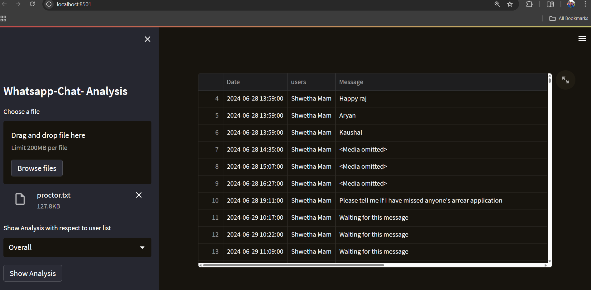
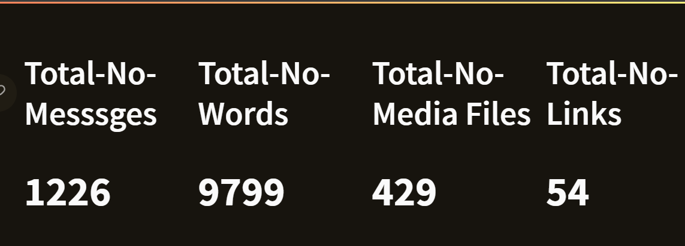
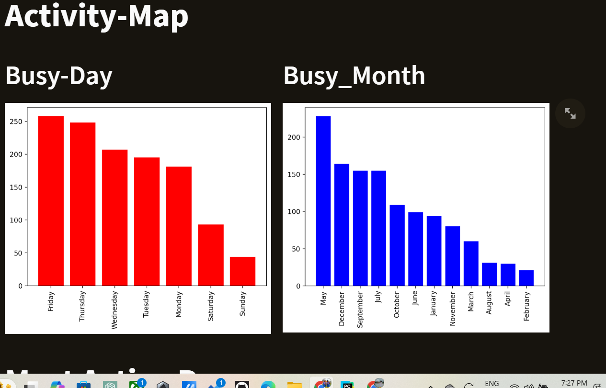
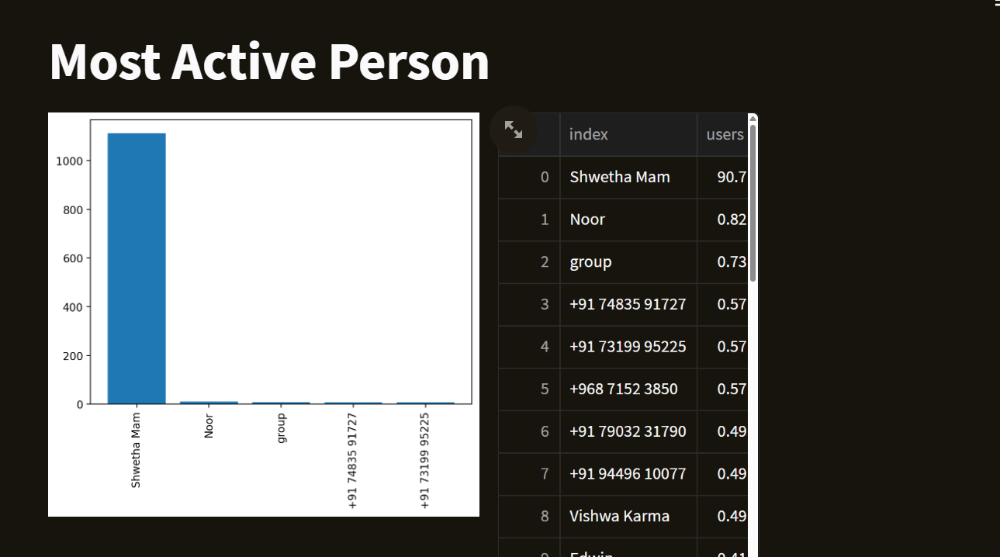
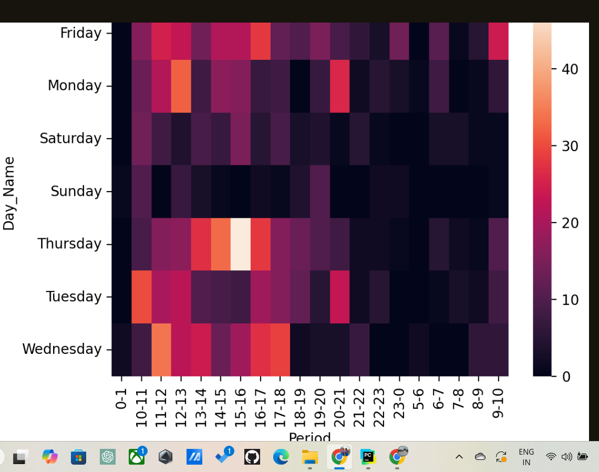
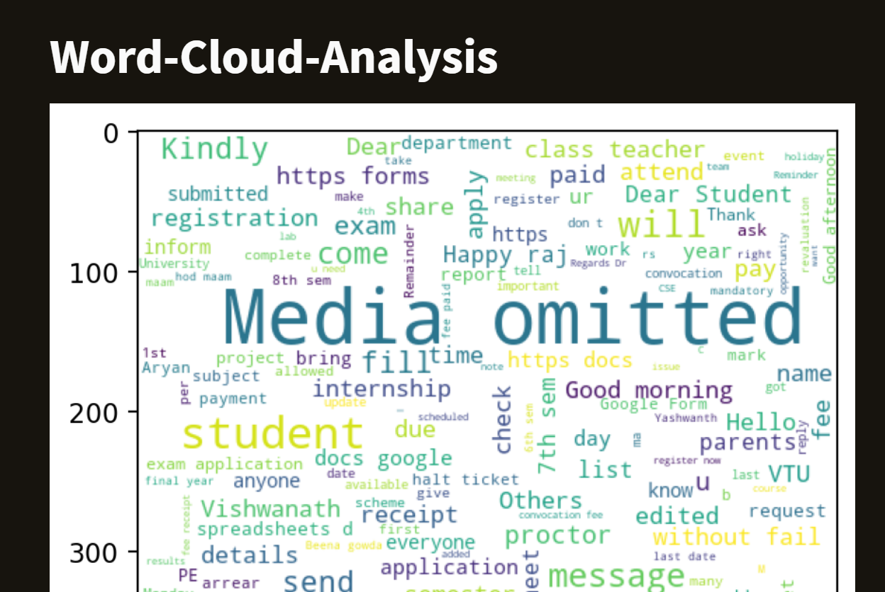
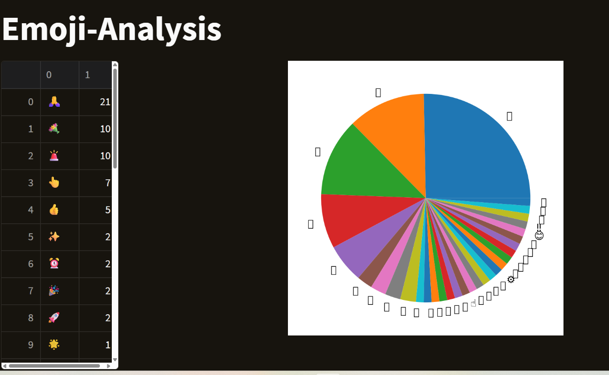

# 📊 WhatsApp Chat Analysis

This project analyzes WhatsApp chat data to extract insights such as most active users, message frequency, and chat patterns.

## 📽️ Demo Video

▶️ [Watch Demo Video](Demo.mp4)

> *(If the video doesn't play on GitHub, download it or open it in a video player.)*

---

## 🖼️ Screenshots

### 1. App Interface

### 2. Overview Stats

### 3. Busy Day & Hours

### 4. Most Active User

### 5. Activity Heatmap

### 6. Emoji Analysis

### 7. WordCloud

---

## 🛠️ Features

- Total messages, words, media shared
- Most active participants
- Emoji usage and word frequency
- Daily and monthly activity breakdown
- Interactive visualizations using `matplotlib` and `seaborn`

---

## 📂 How to Run

1. Upload your exported `.txt` WhatsApp chat file.
2. Run the `main.ipynb` or Python script.
3. Explore insights!

---

## 📎 Requirements

- Python 3.x
- pandas, matplotlib, seaborn, wordcloud, urlextract

---

## 📬 Contact

Created by [Hemanth Gowda](https://github.com/GowdaHemannth)
